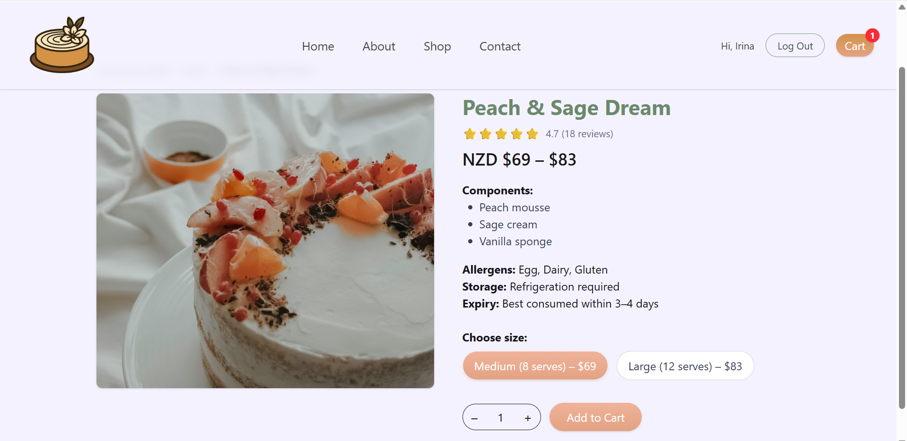

# 🍰 Sweet Magnolia Cakery

A full-stack e-commerce web application for a botanical-inspired cake shop.  
Built with **React, TypeScript, Node.js, Express, and TailwindCSS**.  

This project was developed as part of my software development studies to demonstrate skills in **frontend design, backend API development, database, and user experience design**.  

This is my very first **end-to-end full-stack project**.  
I spent countless hours building it — learning, experimenting, and struggling along the way.  

I’ll admit, I’m not 100% happy with the design yet, but I’m **proud of what I achieved**: a working full-stack application with authentication, API, database, and a responsive frontend.  

For me, this project represents more than code — it’s proof that I can bring an idea to life from start to finish.  

**Live Demo:** [https://your-deployment-url.vercel.app](https://cake-shop-mauve.vercel.app/)  

---

> **Note:**  
> For deployment on Vercel, the app has been temporarily converted to **frontend-only mode**, using hardcoded mock data instead of the full backend/API.  
> The backend code (Express server, database setup, and routes) is still available in the repository for fullstack usage or local development.

---

## Features

### Frontend
- Shop page – Browse cakes in a responsive grid layout.  
- Cake details – Each cake includes image, description, size options, and add-to-cart functionality.  
- Cart page – Add, remove, and update cake quantities with subtotal and total cost calculation.  
- Favourites section – View the most popular cakes on the main page and add them to the cart directly for quick access.
- Responsive design – Optimised for desktop, tablet, and mobile.  
- Custom styling – Botanical colour palette (sage green, peach, cream) with serif + sans-serif typography.  
- User authentication with Auth0 (login, signup, logout). 

### Backend
- Express API that serves cakes data from a database.  
- Database schema managed with **Knex migrations**.  
- Initial cake data populated using **Knex seeds**.  
- Separation of concerns – clear routes for cakes and cart.  

### Other
- Designed as a portfolio project but extendable into a real bakery e-commerce site.  

---

**Frontend:**  
- React + TypeScript  
- React Router  
- TailwindCSS
- Auth0 (user authentication) 

**Backend:**  
- Node.js + Express
- SQLite + Knex (database with migrations and seeds)    

**Other Tools:**  
- Vite (frontend build tool) 

---
## Getting Started

### Prerequisites
Make sure you have installed:
- [Node.js](https://nodejs.org/) (>= 18)  
- [npm](https://www.npmjs.com/)  

### Installation

1. Clone the repo:
   ```bash
   git clone git@github.com:Irina-Kostina/cake-shop.git
   cd sweet-magnolia-cakery
  
2. Install dependencies: 
    ```bash
    npm install

3. Start the frontend:
    ```bash
    npm run dev

---

## Project Structure

```
sweet-magnolia-cakery/
├── client/                # Frontend React app
│   ├── public/            # Static assets
│   ├── src/
│   │   ├── assets/        # Images, fonts, etc.
│   │   ├── components/    # Reusable UI components (Nav, Footer, IntroSection, etc.)
│   │   ├── pages/         # Page-level components (Shop, Cart, etc.)
│   │   ├── App.tsx        # App layout & routing
│   │   ├── App.css        # Global styles
│   │   ├── index.css      # Base styles
│   │   └── main.tsx       # React entry point
│   └── index.html         # Root HTML file
│
├── server/                # Backend Express app
│   ├── db/                # Database setup (Knex migrations and seeds)
│   ├── src/
│   │   ├── routes/        # API endpoints
│   │   │   └── cakes.ts   # Cakes route
│   │   └── index.ts       # Server entry
│
├── .gitignore
├── eslint.config.js
├── package-lock.json
└── README.md
```

---
## Development Notes

- Backend serves cake data from a database (managed with Knex migrations and seeds).
- Cart functionality is managed on the frontend with React Context.  
- Shipping is currently mocked (set to free).  

This project was originally developed as a fullstack application using:
- Frontend: React + Vite
- Backend: Node.js + Express + SQLite (via Knex)

However, for deployment on Vercel, the app was temporarily switched to frontend-only mode to support static hosting.

---
## Live Version on Vercel

Due to Vercel's limitations with server-side Node/Express APIs in non-pro plans, the live version includes only the frontend, with all cake data loaded from a hardcoded mock array instead of a live database/API.

- Cake data is stored directly in the frontend
- All backend functionality is disabled in the deployed version
- Fullstack Code Still Included

The full Express API, database migrations, and seed scripts are still available in the codebase (/server/ folder) and can be run locally.

---

## Future Enhancements

- Add order checkout and payment integration (e.g., Stripe).  
- Create an admin dashboard to add cakes dynamically.  
- Add reviews and ratings.  


---

## Motivation / Learning Goals

This project was created as part of my software development studies.  
The goal was to practise building a **full-stack web application** using React for the frontend and Express for the backend.  

Key learning objectives:  
- Implement clean and reusable React components.  
- Use React Router for multi-page navigation.  
- Manage global state with React Context (cart functionality).  
- Build a simple backend API with Express.  
- Connect frontend and backend together in a full-stack environment.  
- Apply consistent design and styling with TailwindCSS. 

---

## Screenshots

### Main Page


### Shop Page


### Cake Details Page


### Cart Page


---
## Assets / Images

All cake images used in this project were downloaded from stock image sources.  
They are used here for **educational and portfolio purposes only** and are not intended for commercial use.  

If this project is expanded into a real e-commerce site, original photography or properly licensed images would be required.  

---

## License

This project is for educational and portfolio purposes. Feel free to use as a reference, but not for commercial redistribution without permission.


